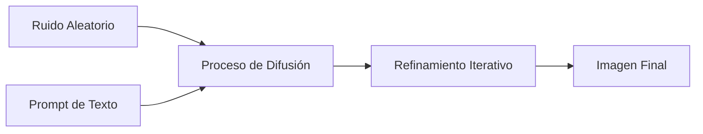

# 🎨 Fundamentos de Prompting Visual

## 📖 Introducción a la IA Generativa de Imágenes

La generación de imágenes con IA utiliza modelos de difusión que aprenden a crear imágenes a partir de ruido aleatorio, guiados por descripciones en texto natural. Entender estos fundamentos te permitirá crear prompts más efectivos y obtener resultados más precisos.

## 🧠 Cómo Funcionan los Modelos de Difusión

### Proceso de Generación



1. **Encoding del Texto**: El prompt se convierte en representaciones numéricas
2. **Ruido Inicial**: Se genera una imagen de ruido aleatorio
3. **Denoising**: El modelo elimina ruido gradualmente guiado por el prompt
4. **Refinamiento**: Múltiples iteraciones mejoran la calidad
5. **Resultado Final**: Imagen coherente con la descripción

### Conceptos Técnicos Clave

#### 🎲 **Seed (Semilla)**
- Número que determina el ruido inicial
- Mismo seed + mismo prompt = imagen idéntica
- Útil para variaciones controladas

#### 🔢 **Steps (Pasos de Difusión)**
- Número de iteraciones de refinamiento
- Más pasos = mejor calidad (hasta cierto punto)
- Típico: 20-50 steps

#### 🎯 **CFG Scale (Guidance Scale)**
- Controla qué tan estrictamente sigue el prompt
- Valores bajos (1-5): Más creatividad, menos adherencia
- Valores altos (10-20): Más fiel al prompt, menos variación

## 📐 Anatomía de un Prompt Visual Efectivo

### Estructura Jerárquica

```
[ELEMENTO PRINCIPAL] → [DETALLES] → [CONTEXTO] → [ESTILO] → [PARÁMETROS]
```

### Componentes Esenciales

#### 1. 🎯 **Sujeto Principal**
```
✅ "Una mujer joven con cabello rizado"
❌ "Una persona"
```

#### 2. 🎭 **Acción o Pose**
```
✅ "leyendo un libro mientras sonríe"
❌ "haciendo algo"
```

#### 3. 🌍 **Entorno y Contexto**
```
✅ "en una biblioteca con luz natural"
❌ "en un lugar"
```

#### 4. 🎨 **Estilo Artístico**
```
✅ "estilo acuarela impressionista"
❌ "bonito"
```

#### 5. ⚙️ **Parámetros Técnicos**
```
✅ "--ar 16:9 --s 500"
❌ [sin especificar]
```

## 🎨 Vocabulario Visual Fundamental

### Composición y Encuadre

#### 📷 **Tipos de Plano**
- **Extreme close-up**: Detalle extremo (ojos, manos)
- **Close-up**: Primer plano (rostro)
- **Medium shot**: Plano medio (torso)
- **Wide shot**: Plano general (figura completa)
- **Establishing shot**: Plano de establecimiento (contexto amplio)

#### 📐 **Ángulos de Cámara**
- **Eye level**: Nivel de ojo (natural)
- **High angle**: Ángulo alto (desde arriba)
- **Low angle**: Ángulo bajo (desde abajo)
- **Bird's eye view**: Vista de pájaro
- **Worm's eye view**: Vista de gusano

#### 🎯 **Reglas de Composición**
- **Rule of thirds**: Regla de tercios
- **Golden ratio**: Proporción áurea
- **Leading lines**: Líneas guía
- **Symmetry**: Simetría
- **Framing**: Enmarcado natural

### Iluminación y Atmósfera

#### ☀️ **Tipos de Luz**
- **Hard light**: Luz dura (sombras definidas)
- **Soft light**: Luz suave (sombras difusas)
- **Natural light**: Luz natural
- **Artificial light**: Luz artificial
- **Mixed lighting**: Iluminación mixta

#### 🌅 **Calidad de Luz**
- **Golden hour**: Hora dorada (cálida)
- **Blue hour**: Hora azul (fría)
- **Harsh sunlight**: Sol directo (contrastado)
- **Overcast**: Nublado (difuso)
- **Candlelight**: Luz de vela (íntima)

#### 🎭 **Esquemas de Iluminación**
- **Rembrandt**: Triángulo de luz en mejilla
- **Butterfly**: Sombra de mariposa bajo nariz
- **Split**: Mitad iluminada, mitad en sombra
- **Rim**: Luz de contorno
- **Backlighting**: Contraluz

### Estilos Artísticos

#### 🖼️ **Movimientos Clásicos**
- **Renaissance**: Renacentista (técnica perfecta)
- **Baroque**: Barroco (dramático, ornamentado)
- **Impressionism**: Impresionismo (pinceladas sueltas)
- **Expressionism**: Expresionismo (emocional, distorsionado)
- **Surrealism**: Surrealismo (onírico, fantástico)

#### 🎨 **Técnicas Artísticas**
- **Oil painting**: Pintura al óleo
- **Watercolor**: Acuarela
- **Pencil sketch**: Boceto a lápiz
- **Digital art**: Arte digital
- **Mixed media**: Técnica mixta

#### 📸 **Estilos Fotográficos**
- **Portrait photography**: Fotografía de retrato
- **Street photography**: Fotografía callejera
- **Landscape photography**: Fotografía de paisaje
- **Macro photography**: Macrofotografía
- **Fine art photography**: Fotografía artística

## 🔧 Técnicas de Optimización

### 1. **Prompt Weighting (Énfasis)**

```
Sintaxis: (palabra:peso)
- (importante:1.2) = 120% de importancia
- (menos importante:0.8) = 80% de importancia
- ((muy importante)) = ~110% de importancia
- [[menos énfasis]] = ~90% de importancia
```

**Ejemplo:**
```
Una (hermosa:1.3) mujer con (cabello rizado:1.1) 
leyendo un libro, [fondo borroso:0.8], 
estilo ((pintura al óleo:1.2))
```

### 2. **Negative Prompts (Prompts Negativos)**

Especifica qué NO quieres en la imagen:

```
Negative prompt: 
blur, blurry, low quality, pixelated, 
extra limbs, deformed hands, 
bad anatomy, watermark, signature
```

### 3. **Iteración Progresiva**

#### Paso 1: Base Simple
```
Un gato durmiendo
```

#### Paso 2: Agregar Detalles
```
Un gato naranja durmiendo en un sofá
```

#### Paso 3: Mejorar Composición
```
Un gato naranja durmiendo pacíficamente 
en un sofá de terciopelo azul, 
luz suave de la tarde
```

#### Paso 4: Estilo y Técnica
```
Un gato naranja durmiendo pacíficamente 
en un sofá de terciopelo azul, 
luz suave de la tarde filtrándose por la ventana,
estilo pintura al óleo impressionista,
colores cálidos y acogedores
```

## ⚖️ Balance en los Prompts

### Especificidad vs. Creatividad

```
Muy Específico (Menos Creatividad):
"Un golden retriever de 2 años, sentado en una silla 
de madera de roble, mirando exactamente hacia la cámara,
con collar rojo de cuero, en una habitación con paredes blancas"

Balanceado:
"Un golden retriever joven sentado en una silla de madera,
mirando hacia la cámara con expresión amigable,
habitación luminosa con decoración casera"

Muy General (Más Creatividad):
"Un perro dorado en interior acogedor"
```

### Longitud Óptima

- **Corto (5-15 palabras)**: Máxima creatividad, menos control
- **Medio (15-40 palabras)**: Balance ideal para la mayoría de casos
- **Largo (40+ palabras)**: Máximo control, puede limitar creatividad

## 🎯 Casos de Uso por Categorías

### 📸 **Fotografía Realista**
```markdown
Estructura recomendada:
[Sujeto] + [Pose/Acción] + [Entorno] + [Tipo de fotografía] + [Parámetros técnicos]

Ejemplo:
"Una mujer de 30 años sonriendo, 
sentada en un café parisino,
portrait photography, natural lighting,
shallow depth of field, 85mm lens,
professional headshot style"
```

### 🎨 **Arte Conceptual**
```markdown
Estructura recomendada:
[Concepto central] + [Elementos simbólicos] + [Estilo artístico] + [Paleta de colores]

Ejemplo:
"El concepto del tiempo representado como 
una espiral dorada flotando sobre un océano tranquilo,
con relojes antiguos emergiendo de las olas,
estilo surrealista como Salvador Dalí,
colores azules profundos con dorados luminosos"
```

### 🏰 **Escenarios y Ambientes**
```markdown
Estructura recomendada:
[Tipo de lugar] + [Arquitectura/Elementos] + [Atmósfera] + [Iluminación] + [Mood]

Ejemplo:
"Una biblioteca gótica abandonada 
con estanterías enormes cubiertas de musgo,
rayos de luz filtrándose por vitrales rotos,
partículas de polvo flotando en el aire,
atmósfera melancólica y misteriosa,
colores verdes y dorados apagados"
```

## 🚫 Errores Comunes y Soluciones

### Error 1: Prompts Demasiado Vagos
❌ **Malo:** "Una persona bonita"
✅ **Mejor:** "Una mujer de 25 años con cabello castaño ondulado, sonrisa natural, retrato al aire libre con luz dorada"

### Error 2: Contradicciones Estilísticas
❌ **Malo:** "Estilo hiperrealista cartoon manga anime"
✅ **Mejor:** "Estilo anime manga con colores vibrantes"

### Error 3: Demasiados Elementos
❌ **Malo:** "Un gato, un perro, un pájaro, una mariposa, flores, árboles, montañas, río, arcoíris, castillo..."
✅ **Mejor:** "Un gato y un perro jugando en un jardín con flores, composición simple"

### Error 4: Términos Ambiguos
❌ **Malo:** "Imagen épica, súper cool, increíble"
✅ **Mejor:** "Composición dramática con iluminación cinematográfica"

## 📊 Métricas de Calidad

### Evaluación de Resultados

#### ✅ **Coherencia**
- ¿Los elementos tienen sentido juntos?
- ¿La anatomía es correcta?
- ¿El estilo es consistente?

#### ✅ **Fidelidad al Prompt**
- ¿Incluye todos los elementos solicitados?
- ¿El estilo coincide con lo pedido?
- ¿La composición es la esperada?

#### ✅ **Calidad Técnica**
- ¿La resolución es adecuada?
- ¿Hay artefactos o errores visibles?
- ¿Los detalles están bien definidos?

#### ✅ **Impacto Visual**
- ¿Es visualmente atractiva?
- ¿Comunica el mensaje deseado?
- ¿Tiene personalidad única?

## 🛠️ Herramientas de Apoyo

### Generadores de Prompts
- **PromptHero**: Biblioteca de prompts exitosos
- **Lexica**: Explorador visual de Stable Diffusion
- **PublicPrompts**: Comunidad de prompts

### Analizadores de Imágenes
- **CLIP Interrogator**: Ingeniería inversa de prompts
- **DeepDanbooru**: Etiquetado automático
- **Image-to-Prompt**: Conversión imagen a texto

### Referencias Visuales
- **Pinterest**: Inspiración y referencias
- **ArtStation**: Arte conceptual profesional
- **Behance**: Portafolios de diseñadores

## 🎓 Ejercicios Prácticos

### Ejercicio 1: Análisis de Prompt
Analiza este prompt e identifica sus componentes:
```
"A majestic white wolf standing on a cliff overlooking a vast forest, 
golden hour lighting, mist rising from the valley below, 
epic fantasy landscape, detailed fur texture, 
painted in the style of classical romanticism"
```

### Ejercicio 2: Optimización Progresiva
Mejora este prompt paso a paso:
```
Inicial: "Un robot en la ciudad"
```

### Ejercicio 3: Corrección de Errores
Identifica y corrige los problemas en este prompt:
```
"Super epic mega awesome robot warrior fighting dragon 
in space cyberpunk anime realistic oil painting 
with lasers and magic and explosions everywhere"
```

## 🔗 Próximos Pasos

Una vez dominados estos fundamentos:

1. 🤖 [Explora DALL-E específicamente](dalle.md)
2. 🎨 [Domina Midjourney](midjourney.md)
3. ⚙️ [Aprende Stable Diffusion](stable-diffusion.md)
4. 🎭 [Experimenta con estilos artísticos](estilos-artisticos.md)

---

🏠 [Volver a IA de Imagen](README.md) | ➡️ [Siguiente: DALL-E](dalle.md)